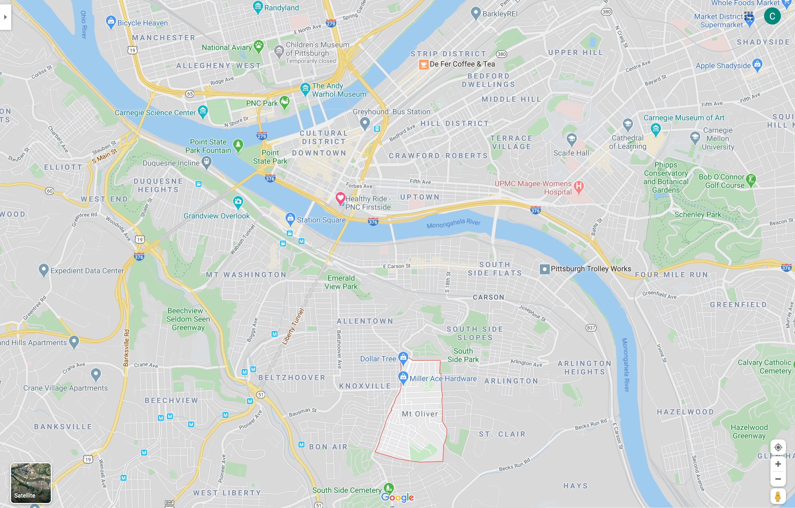

```{r setup, include=FALSE}
knitr::opts_chunk$set(echo = TRUE,
                      message = FALSE,
                      warning = FALSE)
```

## Introduction

My goal is to create a classification model that can distinguish between tracts that are inside the city or outside the City of Pittsburgh. The border is interrupted by rivers, has an enclave, and is very irregular in general, which made this an interesting intellectual exercise.

### City of Pittsburgh Border

While Pittsburgh was founded in 1758, the city's borders have changed many times due to annexation of surrounding municipalities. [This map](https://en.wikipedia.org/wiki/Allegheny,_Pennsylvania) shows that what we call the North Side was previously Allegheny City, and was annexed into the city in 1907.


Mt. Oliver is a geographic enclave that is completely surrounded by the City of Pittsburgh, but is a separate municipality. The borough has [resisted multiple annexation attempts](https://www.wesa.fm/post/how-mt-oliver-borough-eluded-city-pittsburgh-annexation#stream/0).


### Modeling

This code loads the packages I need, configures some options, and sets the seed.
```{r}
#set up environment
library(tidyverse)
library(tidymodels)
library(janitor)
library(tidycensus)
library(sf)
library(hrbrthemes)
library(GGally)

theme_set(theme_ipsum(base_size = 15))

options(scipen = 999, digits = 4, tigris_use_cache = TRUE)

set.seed(1234)
```

I created a small Shiny app that let me select which tracts are inside the city borders. I will go over that in a future post. This loads the tracts from the Census API and pulls the results from the Shiny app.
```{r}
#load data about census tracts
tracts <- get_decennial(year = 2010, state = "PA", county = "Allegheny County", 
                        variables = "P001001",
                        geography = "tract", geometry = TRUE)

city_tracts <- read_csv("data/selected_tracts.csv", col_types = cols("c", "l")) %>% 
  filter(selected == TRUE)

glimpse(city_tracts)
```

This reads in the boundary shapefile and graphs it to show which tracts are in the city.
```{r}
pgh_official_boundary <- st_read("data/Pittsburgh_City_Boundary-shp") %>% 
  mutate(geography = "City boundary") %>% 
  st_transform(crs = "NAD83") %>% 
  st_cast("POLYGON") %>% 
  filter(FID != 7)

tracts %>% 
  left_join(city_tracts) %>% 
  mutate(type = case_when(selected == TRUE ~ "city",
                          is.na(selected) ~ "non_city")) %>% 
  ggplot() +
  geom_sf(aes(fill = type), size = .1) +
  geom_sf(data = pgh_official_boundary, color = "white", linetype = 2, alpha = 0) +
  theme_void()
```
This reads in the data I will consider for the model.
```{r}
all_data <- read_csv("data/combined_census_data_tract.csv", col_types = cols(.default = "c")) %>%
  left_join(city_tracts) %>% 
  mutate(type = case_when(selected == TRUE ~ "city",
                          is.na(selected) ~ "non_city")) %>% 
  mutate(across(pct_units_owned_loan:housed_population_density_pop_per_square_km, as.numeric)) %>% 
  select(GEOID, type, everything()) %>%
  select(-c(selected, total_population_housed))

glimpse(all_data)
```

This plot compares all of the variables against each other. I used this to identify covariance and determine which variables should be excluded.
```{r eval=FALSE}
#eda
pairwise_plot <- all_data %>% 
  select(-c(GEOID)) %>% 
  ggpairs(aes(color = type)) +
  theme(axis.text = element_text(size = 8))
```


After reviewing this graph and considering things like covariance and zero-variance, I will use these variables in the model:

* Housing
  * Percent of housing units owned outright
  * Percent of housing units owned with a mortgage
  * Percent of housing units rented
* Demographics
  * Percent of people in the tract that are
    * White
    * Black
* Population density
* Economic data
  * Number of workers that live in the tract
  * Number of jobs in the tract

This finalizes the data I will use to build the model.
```{r}
census_combined <- all_data %>% 
  select(GEOID, type, 
         pct_units_owned_loan, pct_units_owned_entire, pct_units_rented,
         housed_population_density_pop_per_square_km,
         pct_white, pct_black,
         workers, jobs)

glimpse(census_combined)
```

34% of the tracts are in the city, which is a slightly unbalanced dataset.
```{r}
census_combined %>% 
  tabyl(type)
```

Since the total amount of data available is small, I will bootstrap the data to try to achieve more stable results from the model. [Bootstrapping resamples the data with replacement](https://www.tidymodels.org/learn/statistics/bootstrap/), which creates multiple replicates of the original dataset with some variation due to sampling. I created a meme of my dog Quincy to illustrate the effect: 

I stratify by `type` so that each bootstrap has ~34% `city` tracts. This generates 50 sets of data for the model to work with.
```{r}
tract_boot <- bootstraps(census_combined, strata = type, times = 50)

tract_boot
```

This code chunk prepares the data to be modeled. I define the formula and scale all the numeric variables to have a mean of 0 and standard deviation of 1.
```{r}
#recipe
model_recipe <- recipe(type ~ ., data = census_combined) %>% 
  update_role(GEOID, new_role = "id") %>% 
  step_normalize(all_predictors())

model_recipe_prep <- model_recipe %>% 
  prep(strings_as_factors = FALSE)

model_recipe_prep %>% 
  summary()
```

This creates the model specifications for the two types of models I will use.
```{r}
#logistic regression
lm_model <- logistic_reg(mode = "classification") %>% 
  set_engine("glm")

#random forest
ranger_model <- rand_forest(trees = 1000, mode = "classification") %>%
  set_engine("ranger", importance = "impurity")
```

This sets up a workflow object to fit a logistic regression model against the bootstrap resamples I created earlier.
```{r cache=TRUE}
#logistic regression
lm_workflow <- workflow() %>% 
  add_recipe(model_recipe_prep) %>% 
  add_model(lm_model)

lm_res <- lm_workflow %>% 
  fit_resamples(resamples = tract_boot) %>% 
  mutate(model = "lm")

lm_res %>% 
  collect_metrics()
```

The logistic regression gets ~76% accuracy, which is pretty good, but I want to know if a random forest could do better. This creates a workflow to fit a random forest model, and saves the predictions so I can use them later.
```{r cache=TRUE}
#rf
rf_workflow <- workflow() %>% 
  add_recipe(model_recipe_prep) %>% 
  add_model(ranger_model)

rf_res <- rf_workflow %>% 
  fit_resamples(resamples = tract_boot,
                control = control_resamples(save_pred = TRUE)) %>% 
  mutate(model = "rf")

rf_res %>% 
  collect_metrics()
```

If you compare the results of the two models, the random forest model does much better than the logistic regression model.
```{r}
combined_res <- bind_rows(rf_res, lm_res)

combined_res %>% 
  unnest(.metrics) %>% 
  ggplot(aes(.estimate, color = model, fill = model)) +
  geom_density(alpha = .5) +
  facet_wrap(~.metric)
```

This graph shows that the random forest model's false negative and false positive rates are about the same.
```{r}
rf_res %>% 
  collect_predictions() %>% 
  count(type, .pred_class) %>% 
  ggplot(aes(type, .pred_class, fill = n)) +
  geom_tile() +
  labs(x = "Truth",
       y = "Prediction",
       fill = "Number of observations") +
  scale_fill_continuous(label = scales::comma) +
  coord_equal() +
  theme(panel.grid.major = element_blank())
```

This fits the random forest model against the entire dataset to extract the variable importance metrics.
```{r}
#variable importance
var_imp <- rf_workflow %>% 
  fit(juice(model_recipe_prep)) %>% 
  pull_workflow_fit() %>% 
  vip::vi()

var_imp %>%
  mutate(Variable = fct_reorder(Variable, Importance)) %>% 
  ggplot(aes(Importance, Variable)) +
  geom_point()
```

The top 3 variables are the percent of a tract's population that is White, the percent of housing units that are owned with a loan, and the population density. This matches my subjective model of city vs. non-city characteristics. Areas that are low density with majority White demographics where people own their homes are typically outside of the city. This dynamic is probably connected to the [history of segregation and redlining](https://www.wesa.fm/post/pittsburgh-neighborhoods-and-schools-remain-segregated-how-did-it-start#stream/0) in majority African American communities in Pittsburgh.

Since the random forest model was fit against multiple bootstraps, I have multiple predictions per tract. I stratified the bootstraps by `type`, so the `city` and `non_city` tracts were sampled about the same number of times.
```{r}
#extract probabilities from bootstrap resamples
full_predictions <- rf_res %>% 
  collect_predictions() %>% 
  mutate(correct = type == .pred_class) %>%
  left_join(census_combined %>%
              mutate(.row = row_number()))

full_predictions %>% 
  count(type, GEOID) %>% 
  ggplot(aes(n, fill = type, color = type)) +
  geom_density(alpha = .3) +
  labs(x = "Number of observations of a tract")
```

I am not solely interested in the top-line accuracy of the model. Since the city border is a geographic phenomenon, there may be interesting patterns in the geographic distribution of the model's predictions that can be shown on a map.

To map the data, I calculate the following metrics per tract:

* the percent of predictions that were correct
* average city classification %
* average non-city classification %
* the number of times the tract was sampled

```{r}
full_predictions_pct <- full_predictions %>% 
  group_by(GEOID) %>% 
  summarize(pct_correct = mean(correct),
            mean_city = mean(.pred_city),
            mean_non_city = mean(.pred_non_city),
            n = n())

glimpse(full_predictions_pct)
```

This shows the % of correct predictions per tract. The model was very successful with the outlying tracts in the county, but struggled in Mt. Washington/Beechview/Brookline, the Hazelwood/Greenfield area, and Forest Hills towards Monroeville.
```{r}
tracts %>% 
  left_join(full_predictions_pct) %>% 
  ggplot() +
  geom_sf(aes(fill = pct_correct), size = NA) +
  geom_sf(data = pgh_official_boundary, alpha = 0, color = "black", size = 2) +
  geom_sf(data = pgh_official_boundary, alpha = 0, color = "yellow", size = .3) +
  scale_fill_viridis_c(labels = scales::percent) +
  labs(fill = "% predictions correct") +
  theme_void()
```

This shows the average % that the model classified a tract as being in the city. The model was very confident that Oakland, Shadyside, and Squirrel Hill are in the city. The model also thought that many communities to the east and communities along the Monongahela River are in the city, specifically McKeesport and West Mifflin.
```{r}
tracts %>% 
  left_join(full_predictions_pct) %>% 
  ggplot() +
  geom_sf(aes(fill = mean_city), size = NA) +
  geom_sf(data = pgh_official_boundary, alpha = 0, color = "black", size = 2) +
  geom_sf(data = pgh_official_boundary, alpha = 0, color = "yellow", size = .3) +
  scale_fill_viridis_c(labels = scales::percent) +
  labs(fill = "Average city classification %") +
  theme_void()
```
To review, I think it would be difficult to create a model that almost perfectly captures the current city border, which is a result of political decisions, court cases, and other non-deterministic phenomena. In addition, white flight and the relative expansion of the suburbs during the collapse of the steel industry reshaped the Pittsburgh metro area. City borders are defined by people and politicians, not a clustering algorithm based on Census data (although that would be interesting). My experience is that many people that don't technically live within the border consider themselves to be Pittsburghers. So what is a border, anyways?

## References

* https://juliasilge.com/blog/multinomial-volcano-eruptions/
* http://www.rebeccabarter.com/blog/2020-03-25_machine_learning/#split-into-traintest
* https://www.brodrigues.co/blog/2018-11-25-tidy_cv/
* https://agailloty.rbind.io/en/post/tidymodels/
* https://alison.rbind.io/post/2020-02-27-better-tidymodels/
* https://hansjoerg.me/2020/02/09/tidymodels-for-machine-learning/
* https://towardsdatascience.com/modelling-with-tidymodels-and-parsnip-bae2c01c131c
* https://www.benjaminsorensen.me/post/modeling-with-parsnip-and-tidymodels/
* https://rviews.rstudio.com/2019/06/19/a-gentle-intro-to-tidymodels/
* https://en.wikipedia.org/wiki/Allegheny,_Pennsylvania