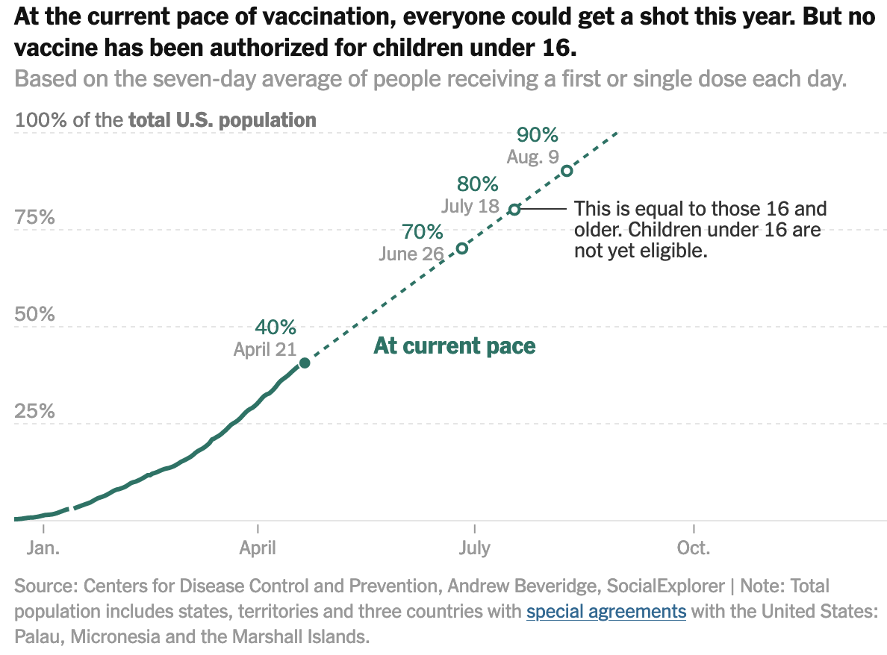

```{r setup, include=FALSE}
knitr::opts_chunk$set(echo = TRUE, 
                      warning = FALSE, 
                      message = FALSE)
```

Like many other Americans, I have been following the COVID-19 vaccination campaign closely. I have found the graphs and data on the [NYTimes](https://www.nytimes.com/interactive/2020/us/covid-19-vaccine-doses.html) and [Bloomberg](https://www.bloomberg.com/graphics/covid-vaccine-tracker-global-distribution/) sites very useful for tracking trends.

This graph on the NYTimes site is particularly good, I think.
```{r, echo = FALSE}

```

You can follow the trend of past vaccinations, and the forecast is useful.

I wanted to know how it would look if multiple "historical" forecasts started along the trend line, in addition to the "current pace" line. This is possible with some nested tibbles and `ggplot2`. I walk through some of the data quality issues with the dataset at the end.

Set up the environment:
```{r}
library(tidyverse)
library(tidycensus)
library(sf)
library(broom)
library(lubridate)
library(janitor)
library(hrbrthemes)
library(ggrepel)
library(tune)
library(slider)
library(broom)

theme_set(theme_ipsum())

options(scipen = 999, digits = 4)
```

This sets up the total date range I will consider for the analysis:
```{r}
#set date range to examine.
date_seq <- seq.Date(from = ymd("2020-12-01"), to = ymd("2022-08-01"), by = "day")
```

I use the COVID-19 vaccine distribution data from [Johns Hopkins University](https://github.com/govex/COVID-19).
```{r, eval = FALSE}
#download data from JHU
vacc_data_raw <- read_csv("https://raw.githubusercontent.com/govex/COVID-19/master/data_tables/vaccine_data/us_data/time_series/vaccine_data_us_timeline.csv") %>% 
  clean_names() %>% 
  #filter to only keep vaccine type All, which will show the cumulative sum of doses for all vaccine types
  filter(vaccine_type == "All") %>% 
  #select state, date, vaccine type, and stage one doses
  select(province_state, date, stage_one_doses) %>% 
  #for each state, pad the time series to include all the dates in date_seq
  complete(date = date_seq, province_state) %>% 
  #sort by state and date
  arrange(province_state, date)
```

```{r, include = FALSE}
vacc_data_raw <- read_csv("data/jhu_covid_data") %>% 
  clean_names() %>% 
  #filter to only keep vaccine type All, which will show the cumulative sum of doses for all vaccine types
  filter(vaccine_type == "All") %>% 
  #select state, date, vaccine type, and stage one doses
  select(province_state, date, stage_one_doses) %>% 
  #for each state and vaccine type, pad the time series to include all the dates in date_seq
  complete(date = date_seq, province_state) %>% 
  #sort by state and date
  arrange(province_state, date)
```
```{r}
vacc_data_raw
```

This replaces `NA` values of `stage_one_doses` with 0 if it occurred before the current date.
```{r}
vacc_data <- vacc_data_raw %>% 
  mutate(stage_one_doses = case_when(date < ymd("2021-04-22") & is.na(stage_one_doses) ~ 0,
                                     !is.na(stage_one_doses) ~ stage_one_doses,
                                     TRUE ~ NA_real_)) %>% 
  arrange(province_state, date)
```

This shows the cumulative sum of first doses by `province_state`. This reveals some data quality issues that I discuss later in the post.
```{r}
vacc_data %>% 
  filter(date <= ymd("2021-04-22")) %>% 
  ggplot(aes(date, stage_one_doses, group = province_state)) +
  geom_line(alpha = .5, size = .3) +
  scale_y_comma()
```

This calculates the total sum of first doses by date.
```{r}
vacc_data <- vacc_data %>% 
  group_by(date) %>% 
  summarize(stage_one_doses = sum(stage_one_doses, na.rm = F)) %>%
  ungroup()
```

The inconsistent data reporting issues bubble up to the national level. I will take a 7-day trailing average to smooth that out.
```{r}
vacc_data %>% 
  filter(date <= ymd("2021-04-22")) %>% 
  ggplot(aes(date, stage_one_doses)) +
  geom_line()
```

This calculates the number of new doses given out by day. If the difference between day 1 and day 0 is negative, I replace it with 0.
```{r}
vacc_data <- vacc_data %>% 
  mutate(stage_one_doses_new = stage_one_doses - lag(stage_one_doses, n = 1),
         stage_one_doses_new = case_when(stage_one_doses_new < 0 ~ 0,
                                         TRUE ~ stage_one_doses_new))
```

This calculates the 7-day trailing average of new first doses distributed.
```{r}
vacc_data_rolling <- vacc_data %>% 
  mutate(stage_one_doses_new_rolling = slide_index_dbl(.i = date,
                                                       .x = stage_one_doses_new,
                                                       .f = mean,
                                                       .before = 6,
                                                       .complete = FALSE))
```

Then I recalculate the cumulative sum of first doses using the trailing average instead of the raw data. This smooths out the data collection issues.
```{r}
vacc_forecast <- vacc_data_rolling %>% 
  fill(stage_one_doses_new_rolling, .direction = "down") %>%
  mutate(future_flag = date >= ymd("2021-04-22")) %>%
  mutate(stage_one_doses_new_rolling_forecast = cumsum(coalesce(stage_one_doses_new_rolling, 0)))

vacc_forecast %>% 
  filter(future_flag == F) %>% 
  ggplot(aes(date, stage_one_doses_new_rolling_forecast)) +
  geom_line() +
  scale_y_comma()
```

This calculates the percent of the population with a first dose vaccination.
```{r}
vacc_forecast <- vacc_forecast %>% 
  mutate(total_pop = 332410303) %>% 
  mutate(vacc_pct = stage_one_doses_new_rolling_forecast / total_pop)

#at the current rate we should hit 90% around July 20th
vacc_forecast %>% 
  filter(vacc_pct > .9) %>% 
  slice(1)
```

This is a basic replication of the NYTimes graph.
```{r}
vacc_forecast %>% 
  filter(date <= ymd("2021-04-22") + 120) %>% 
  ggplot(aes(x = date)) +
  geom_line(aes(y = vacc_pct, color = future_flag)) +
  geom_hline(yintercept = .9, lty = 2) +
  scale_y_percent(limits = c(0, 1), breaks = c(0, .25, .5, .75, .9, 1)) +
  labs(y = "Pct with 1 vaccination")
```

Now to add the "historical" projections. I create a list of dates to filter the data with.
```{r}
month_filters <- c(seq(from = ymd("2021-02-01"), to = ymd("2021-04-01"), by = "month"), ymd("2021-04-22"))

month_filters
```

I use `map` to create 4 dataframes, each only containing data up until the given filter date.
```{r}
vaccine_forecast_data <- 
  month_filters %>% 
  set_names() %>% 
  map(~filter(vacc_data_rolling, date <= .x)) %>% 
  enframe(name = "last_date", value = "historical_data") %>% 
  mutate(last_date = ymd(last_date),
         current_week = last_date == max(last_date))

vaccine_forecast_data
```

```{r}
vaccine_forecast_data %>% 
  unnest(historical_data) %>% 
  filter(date <= ymd("2021-04-22") + 120) %>% 
  ggplot(aes(x = date)) +
  geom_line(aes(y = stage_one_doses)) +
  facet_wrap(~last_date) +
  scale_y_comma()
```

This unnests the tibbles and fills out the future data for each `last_date`
```{r}
vaccine_forecast_data <- 
  vaccine_forecast_data %>% 
  unnest(historical_data) %>% 
  group_by(last_date) %>% 
  #for each filter date table, create rows for the rest of the date range
  complete(date = date_seq) %>% 
  fill(stage_one_doses_new_rolling, current_week, .direction = "down") %>% 
  #create a flag for whether a row is observed or predicted
  mutate(prediction_flag = date >= last_date,
  #create a flag for whether a row is after the current date
         future_flag = date > ymd("2021-04-22")) %>%
  #for each filter date, roll the 7 day moving average of vaccination rate forward
  mutate(stage_one_doses_new_rolling_forecast = cumsum(coalesce(stage_one_doses_new_rolling, 0))) %>% 
  #source of population data: https://www.census.gov/popclock/
  mutate(total_pop = 330175936) %>% 
  #calculate vaccination %
  mutate(vacc_pct = stage_one_doses_new_rolling_forecast / total_pop,
         vacc_pct = round(vacc_pct, 3)) %>% 
  filter(vacc_pct <= 1.1) %>% 
  ungroup()

vaccine_forecast_data
```

This calculates when the vaccination rate hits 100% for each historical projection.
```{r}
vaccine_forecast_data <- 
  vaccine_forecast_data %>% 
  mutate(total_vacc_flag = vacc_pct >= 1) %>% 
  group_by(last_date) %>% 
  mutate(total_vacc_date = case_when(cumsum(total_vacc_flag) >= 1 ~ date,
                                     TRUE ~ NA_Date_)) %>% 
  filter(cumsum(!is.na(total_vacc_date)) <= 1) %>% 
  ungroup()

vaccine_forecast_data <- vaccine_forecast_data %>% 
  mutate(current_week_fct = case_when(current_week == F ~ "Historical projection",
                                      current_week == T ~ "Current rate"))
```

Then I create some secondary tables to annotate the final chart.
```{r}
#secondary tables for labeling
current_vacc_percent <- vaccine_forecast_data %>% 
  filter(current_week == T, date == ymd("2021-04-22")) %>% 
  select(last_date, date, current_week, vacc_pct)

current_vacc_percent_label <- current_vacc_percent %>% 
  mutate(text_label = str_c("Current", scales::percent(vacc_pct), sep = ": "))
```

```{r fig.height=10, fig.width=16}
vaccine_forecast_graph <- vaccine_forecast_data %>% 
  ggplot(aes(x = date, y = vacc_pct, group = last_date)) +
  #90% line
  geom_hline(yintercept = .9, lty = 2) +
  annotate(x = ymd("2021-01-25"), y = .915,
           label = "Herd Immunity Threshhold", geom = "text", size = 6) +
  #past cumulative line
  geom_line(data = filter(vaccine_forecast_data, current_week == T, date <= ymd("2021-04-22")),
            color = "black", lty = 1, size = .7) +
  #future cumulative lines
  geom_line(data = filter(vaccine_forecast_data, prediction_flag == T),
            aes(color = as.factor(last_date)),
            size = 1.3)  +
  # horizontal line showing current vaccination rate
  geom_hline(data = current_vacc_percent,
             aes(yintercept = vacc_pct),
             size = .1) +
  #add labels for date of 100% vaccination for the first and last filter dates
  geom_label(data = filter(vaccine_forecast_data,
                           last_date == min(last_date) | last_date == max(last_date)),
             aes(label = total_vacc_date,
                 color = as.factor(last_date)),
             show.legend = FALSE,
             fill = "grey",
             position = position_nudge(y = .05),
             size = 6) +
  # label for horizontal line showing current vaccination rate
  geom_text(data = current_vacc_percent_label,
            aes(label = text_label),
            position = position_nudge(x = -122, y = .02),
            size = 6) +
  scale_x_date(limits = c(ymd("2020-12-01"), ymd("2022-08-01"))) +
  scale_y_percent(limits = c(0, 1.1), breaks = c(0, .25, .5, .75, .9, 1)) +
  scale_alpha_manual(values = c(1, .5)) +
  scale_color_viridis_d(labels = c("February 1", "March 1", "April 1", 
                                   str_c(month(ymd("2021-04-22"), label = T, abbr = F), mday(ymd("2021-04-22")), sep = " "))) +
  guides(color = guide_legend(override.aes = list(fill = NA))) +
  labs(title = "Historic and Current U.S. Vaccination Forecasts",
       x = NULL,
       y = "Single Dose Vaccination %",
       color = "Projection start date") +
  theme_ipsum(plot_title_size = 25,
              subtitle_size = 23,
              axis_text_size = 23,
              axis_title_size = 25) +
  theme(panel.grid.minor = element_blank(),
        legend.title = element_text(size = 20),
        legend.text = element_text(size = 18))

vaccine_forecast_graph
```

### Data quality issues

#### Cumulative decreases

Due to data collection issues, there are cases where the cumulative sum of vaccinations for a given state actually decreases. I think a lot of this is because of interruptions due to the nation-wide winter storm in February 2021. Other instances could be attributed to changes in methodology for tracking vaccine distribution.
```{r}
vacc_data_raw %>% 
  group_by(province_state) %>% 
  mutate(less_than_prev = stage_one_doses < lag(stage_one_doses, 1)) %>% 
  ungroup() %>% 
  filter(less_than_prev == T) %>% 
  count(date, less_than_prev) %>% 
  ggplot(aes(date, n)) +
  geom_point() +
  labs(x = NULL,
       y = "Bad data observations")
```

This shows that most of the inconsistent data comes from federal agencies, US territories, and Freely Associated States
```{r}
vacc_data_raw %>% 
  group_by(province_state) %>% 
  mutate(less_than_prev = stage_one_doses < lag(stage_one_doses, 1)) %>% 
  ungroup() %>% 
  filter(less_than_prev == T) %>% 
  count(province_state, less_than_prev, sort = T) 
```

This is an example from Alabama:
```{r}
vacc_data_raw %>% 
  mutate(less_than_prev = stage_one_doses < lag(stage_one_doses, 1)) %>% 
  filter(date >= "2021-02-10", date < "2021-02-13",
         province_state == "Alabama") %>% 
  arrange(province_state, date)
```

#### Pennsylvania

From April 17-18th there was a big jump in stage one vaccine distribution in Pennsylvania. It is unclear what caused this jump. My guess is a data collection issue.
```{r}
vacc_data_raw %>% 
  filter(province_state == "Pennsylvania") %>% 
  drop_na(stage_one_doses) %>% 
  ggplot(aes(date, stage_one_doses)) +
  geom_line() +
  scale_y_comma()
```