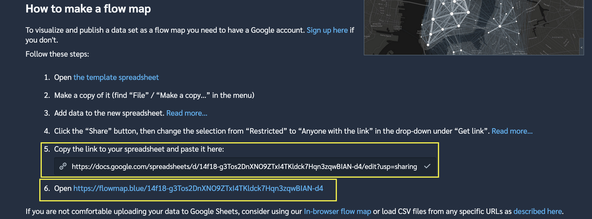

```{r setup, include=FALSE}
knitr::opts_chunk$set(echo = TRUE,
                      eval = FALSE,
                      message = FALSE)
```

This map shows the commuter patterns in the BosWash metro area. I pulled the data from the [Census Longitudinal Employer-Household Dynamics (LODES)](https://lehd.ces.census.gov/data/) system via the `{lehdr}` package. The map was created through the [Flowmap.blue](https://flowmap.blue/) tool, which makes interactive maps of movement between destinations. 

flowmap is here
<iframe src="https://flowmap.blue/14f18-g3Tos2DnXNO9ZTxI4TKldck7Hqn3zqwBIAN-d4?v=41.620996,-75.378680,4.93,0,0&a=0&as=1&b=1&bo=75&c=1&ca=1&d=1&fe=1&lt=1&lfm=ALL&col=interpolateViridis&f=50" width=1000 height=800"></iframe>

```{r}

```
This code is what I used to query the LODES data and aggregate it. First, load the required libraries.
```{r eval=TRUE}
library(tidyverse)
library(tidycensus)
library(janitor)
library(lehdr)
library(tigris)
library(sf)
library(ggraph)
library(tidygraph)

options(tigris_use_cache = TRUE,
        scipen = 999,
        digits = 4)
```

This code gets the `main` and `aux` LODES data for each state that I name in the `states` object. I then combine the data into lodes_combined and check that there are no duplicate origin-destination pairs.
```{r}
#get lodes
states <- c("pa", "wv", "va", "dc", "de",
            "md", "ny", "ri", "ct", "ma", "vt", "nh", "me")

lodes_od_main <- grab_lodes(state = states, year = 2017, 
                            lodes_type = "od", job_type = "JT00", 
                            segment = "S000", state_part = "main", 
                            agg_geo = "county") %>% 
  select(state, w_county, h_county, S000, year) %>% 
  rename(commuters = S000)

lodes_od_aux <- grab_lodes(state = states, year = 2017, 
                           lodes_type = "od", job_type = "JT00", 
                           segment = "S000", state_part = "aux", 
                           agg_geo = "county") %>% 
  select(state, w_county, h_county, S000, year) %>% 
  rename(commuters = S000)

lodes_combined <- bind_rows(lodes_od_main, lodes_od_aux)
```

This code pulls the geometry for the states from the TIGER shapefile API:
```{r eval=TRUE}
counties_combined <- tigris::counties(state = c("PA", "NY", "NJ", "MD", 
                                                "WV", "DE", "VA", 
                                                "DC", "MA", "CT", "VT", 
                                                "RI", "NH", "ME"), 
                                      cb = TRUE) %>% 
  arrange(STATEFP) %>% 
  left_join(fips_codes %>% distinct(state_code, state_name), by = c("STATEFP" = "state_code"))

counties_combined %>% 
  ggplot() +
  geom_sf(aes(fill = state_name))
```

The next step is to calculate the centroid of each county that will be used in the final map.
```{r}
node_pos <- counties_combined %>% 
  mutate(centroid = map(geometry, st_centroid),
         x = map_dbl(centroid, 1),
         y = map_dbl(centroid, 2)) %>% 
  select(GEOID, NAME, x, y) %>% 
  arrange(GEOID) %>% 
  st_drop_geometry() %>% 
  as_tibble() %>% 
  select(-NAME) %>%
  rename(lon = x,
         lat = y) %>% 
  mutate(id = row_number()) %>% 
  select(id, GEOID, lat, lon)
```

Then I add the county and state name to the node positions so the name is intelligible.
```{r}
node_pos <- node_pos %>% 
  left_join(st_drop_geometry(counties_combined), by = c("GEOID" = "GEOID")) %>% 
  mutate(county_name = str_c(NAME, "County", sep = " "),
         name = str_c(county_name, state_name, sep = ", "))

node_pos <- node_pos %>% 
  select(id, name, lat, lon, GEOID)
```

This processes the LODES origin-destination data and creates the node-edge network graph object that will be fed into the Flowmap.blue service.
```{r}
network_graph <- lodes_combined %>%
  semi_join(counties_combined, by = c("w_county" = "GEOID")) %>%
  semi_join(counties_combined, by = c("h_county" = "GEOID")) %>%
  select(h_county, w_county, commuters) %>% 
  as_tbl_graph(directed = TRUE) %>% 
  activate(edges) %>% 
  filter(commuters >= 500,
         #!edge_is_loop()
  ) %>%
  activate(nodes) %>%
  arrange(name)
```
```{r}
nodes <- network_graph %>%
  activate(nodes) %>%
  as_tibble()
```
```{r}
edges <- network_graph %>% 
  activate(edges) %>% 
  as_tibble() %>% 
  rename(origin = from,
         dest = to,
         count = commuters) %>% 
  arrange(desc(count))
```

Finally, this code checks that the node position data matches up with the nodes from the network object. If these checks fail, the origin-destination pairs will be mapped to the wrong geographic coordinates.
```{r}
#check that nodes match up
all(node_pos$GEOID == nodes$name)

identical(node_pos$GEOID, nodes$name)

length(node_pos$GEOID) == length(nodes$name)
```

This code creates the metadata that Flowmap.blue requires and loads the data into Google Sheets.
```{r}
my_properties <- c(
  "title"="BosWash regional US commuter flow",
  "description"="Miniumum 500 commuters per origin-destination pair",
  "source.name"="2017 US Census LODES",
  "source.url"="https://lehd.ces.census.gov/data/",
  "createdBy.name"="Conor Tompkins",
  "createdBy.url"="https://ctompkins.netlify.app/",
  "mapbox.mapStyle"=NA,
  "flows.sheets" = "flows",
  "colors.scheme"="interpolateViridis",
  "colors.darkMode"="yes",
  "animate.flows"="no",
  "clustering"="yes"
)

properties <- tibble(property=names(my_properties)) %>%
  mutate(value=my_properties[property])

drive_trash("lodes_flowmapblue")

ss <- gs4_create("lodes_flowmapblue", sheets = list(properties = properties,
                                                    locations = node_pos,
                                                    flows = edges))
```

The final step is to allow the Google Sheet to be read by anyone with the link, and copy the Sheet's link to [Flowmap.blue](https://flowmap.blue/)
```{r eval=TRUE}

```