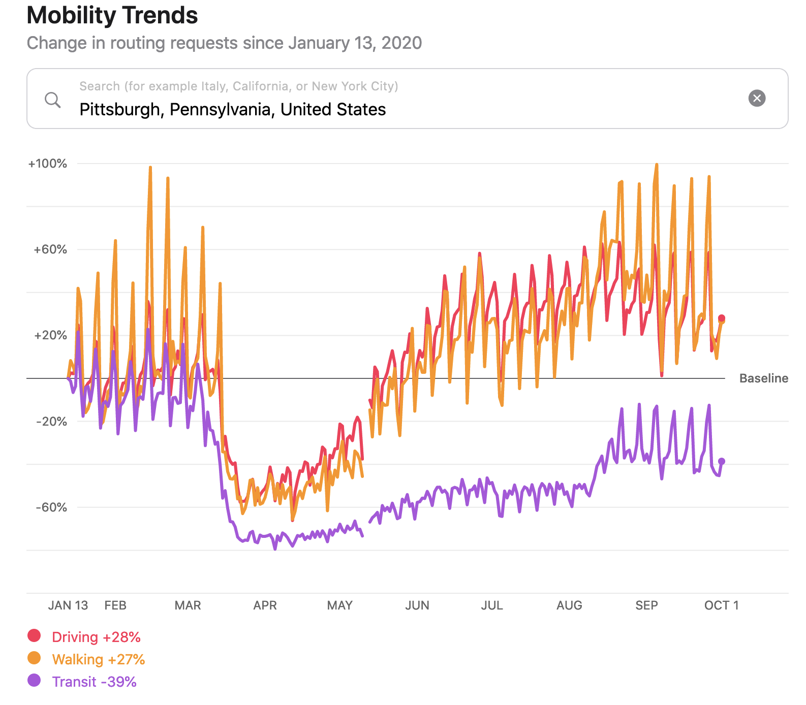

```{r setup, include=FALSE}
knitr::opts_chunk$set(echo = TRUE, 
                      warning = FALSE, 
                      message = FALSE)
```

The COVID-19 pandemic's affect on commerce and mobility habits is well documented. For example, Apple publishes [Mobility Trends reports](https://covid19.apple.com/mobility) about utilization of various transportation modes.

[](https://covid19.apple.com/mobility)

Apple's data shows that utilization of driving in Pittsburgh dropped significantly in late March, but has rebounded above pre-COVID-19 levels since then.

The [WPDRC](https://data.wprdc.org/dataset/parking-transactions) publishes parking meter transactions for 60 parking zones in Pittsburgh. In this post I will use the frequency of parking transactions over time as a proxy for commercial activity in the city. This information only represents commerce that people use vehicles to perform, so it does not include mass transit or drivers that use private parking areas or meters that are not captured in this dataset. I will be interested to see if the parking meter data matches Apple's report about driving.

## Top-level analysis

#### Read in data

```{r}
library(tidyverse)
library(lubridate)
library(vroom)
library(hrbrthemes)
library(scales)
library(plotly)
library(broom)
library(heatwaveR)
library(gt)

options(scipen = 999,
        digits = 4)

theme_set(theme_ipsum())
```

As of September 28th there are \~5 million rows in the dataset. Each row consists of a 10-minute period in a given zone with the aggregated number of transactions and the amount paid.

```{r}
data <- vroom("data/1ad5394f-d158-46c1-9af7-90a9ef4e0ce1.csv")

glimpse(data)
```

There are 60 distinct parking zones in the dataset.

```{r}
data %>% 
  distinct(zone) %>% 
  arrange(zone)
```

This code chunk performs most of the aggregation and manipulation. It separates the `start` column into `start_date` and `start_time`, calculates the number of transactions per day, and creates some date columns that I use later.

```{r eval = FALSE}
df_ts <- data %>%
  select(start, meter_transactions, mobile_transactions) %>%
  separate(start, into = c("start_date", "start_time"), remove = TRUE, sep = " ") %>%
  mutate(start_date = ymd(start_date)) %>%
  group_by(start_date) %>%
  summarize(meter_transactions = sum(meter_transactions),
            mobile_transactions = sum(mobile_transactions)) %>%
  ungroup() %>%
  rowwise() %>%
  mutate(total_parking_transactions = meter_transactions + mobile_transactions) %>%
  ungroup() %>%
  mutate(year = year(start_date),
         day_of_year = yday(start_date),
         week_of_year = week(start_date),
         weekday = wday(start_date, label = TRUE)) %>%
  group_by(year, week_of_year) %>%
  mutate(first_date_of_week = min(start_date)) %>% 
  ungroup() %>% 
  select(start_date, year, week_of_year, day_of_year, weekday, everything())
```

```{r echo = FALSE}
df_ts <- read_csv("data/summarized_parking_data.csv") %>% 
  group_by(year, week_of_year) %>%
  mutate(first_date_of_week = min(start_date)) %>% 
  ungroup() %>% 
  #select(-start_date) %>% 
  select(first_date_of_week, everything())
```

## Overall timeline

This view of the daily transactions shows that parking transactions dropped off steeply in late March 2020.

```{r}
df_ts %>% 
  ggplot(aes(first_date_of_week, total_parking_transactions)) +
  geom_point(alpha = .2, size = .5) +
  labs(title = "Daily parking transactions",
       subtitle = "2014-2020",
       x = "Year",
       y = "Total parking transactions") +
  scale_y_comma() +
  scale_x_date(date_labels = "%Y")
```

#### 2020 vs. previous years

Starting in March, parking transactions in 2020 fell way below the historical norm. At the most extreme, weekly transactions fell below 10,000.

```{r}
compare_2020_before <- df_ts %>% 
  select(year, week_of_year, total_parking_transactions) %>% 
  group_by(year, week_of_year) %>% 
  summarize(total_parking_transactions = sum(total_parking_transactions)) %>% 
  group_by(week_of_year) %>% 
  mutate(week_median_parking_events = median(total_parking_transactions)) %>% 
  ungroup() %>% 
  mutate(period = case_when(year == 2020 ~ "2020",
                               year < 2020 ~ "Before times"))

compare_2020_before %>% 
  ggplot(aes(x = week_of_year, y = total_parking_transactions, color = period, group = year)) +
  geom_hline(yintercept = 0) +
  geom_line(data = compare_2020_before %>% filter(period == "Before times"),
            size = 1.5, alpha = .7) +
  geom_line(data = compare_2020_before %>% filter(period == "2020"),
            size = 1.5) +
  scale_x_continuous(breaks = seq(0, 54, by = 4)) +
  scale_color_manual(values = c("red", "grey")) +
  scale_y_comma(breaks = seq(0, 200000, by = 20000)) +
  labs(title = "Weekly parking transactions",
       x = "Week of year",
       y = "Total parking events",
       color = "Period")
```

#### 2020 vs. historical average

This code calculates the % difference between the number of parking transactions in 2020 and the historical average for a given week.

```{r}
data_historical <- df_ts %>% 
  filter(start_date < "2020-01-01") %>% 
  select(year, week_of_year, total_parking_transactions) %>% 
  group_by(year, week_of_year) %>% 
  summarize(total_parking_transactions = sum(total_parking_transactions)) %>% 
  group_by(week_of_year) %>% 
  summarize(median_historical_transactions = median(total_parking_transactions),
            day_count = n()) %>% 
  ungroup()
```

```{r}
data_2020 <- df_ts %>% 
  select(start_date, first_date_of_week, week_of_year, total_parking_transactions) %>% 
  filter(start_date >= "2020-01-01",
         #remove current week of data
         week_of_year < week(Sys.Date())) %>% 
  group_by(first_date_of_week, week_of_year) %>% 
  summarize(total_parking_transactions = sum(total_parking_transactions)) %>% 
  ungroup()
```

```{r}
df <- data_2020 %>% 
  left_join(data_historical)
```

```{r}
smoothed_line_df <- df %>% 
  mutate(pct_difference = (total_parking_transactions - median_historical_transactions) / median_historical_transactions) %>% 
  select(week_of_year, first_date_of_week, pct_difference) %>% 
  nest(parking_data = everything()) %>% 
  mutate(model = map(parking_data, ~loess(pct_difference ~ week_of_year, data = .x, span = .3)),
         coeff = map(model, augment))

smoothed_line_df <- smoothed_line_df %>% 
  unnest(parking_data) %>% 
  left_join(unnest(smoothed_line_df, coeff)) %>% 
  select(first_date_of_week, .fitted) %>% 
  mutate(sign = .fitted > 0,
         population = "total")
```

This shows that after starting 2020 slightly above average, parking transactions fell to almost -100% in early April.

```{r}
smoothed_line_df %>% 
  ggplot(aes(x = first_date_of_week)) +
  heatwaveR::geom_flame(aes(y = 0, y2 = .fitted)) +
  geom_line(aes(y = .fitted), size = 1.5) +
  geom_hline(yintercept = 0, lty = 2) +
  scale_y_percent() +
  labs(title = "2020 vs. historical average",
       x = "Date",
       y = "Percent difference")
```

While the number of transactions recovered from the depths of March and April, it has not matched the increase that Apple's mobility report showed for driving after May. Parking transactions are still 50% below their historical average.

#### Weekday vs weekend difference, 2020 vs. historical

The difference between the number of parking transactions on weekdays vs. weekends did not change significantly after March 2020.

```{r}
weekday_weekend_df <- df_ts %>% 
  select(start_date, week_of_year, weekday, total_parking_transactions) %>% 
  mutate(period = case_when(start_date >= "2020-01-01" ~ "2020",
                            start_date < "2020-01-01" ~ "Before times"),
         is_weekend = case_when(weekday %in% c("Sat", "Sun") ~ "weekend",
                                !(weekday %in% c("Sat", "Sun")) ~ "weekday")) %>% 
  mutate(period = fct_relevel(period, "Before times"),
         is_weekend = fct_relevel(is_weekend, "weekday")) %>% 
  group_by(period, is_weekend) %>% 
  summarize(total_parking_transactions = sum(total_parking_transactions)) %>% 
  mutate(pct_of_parking_transactions = total_parking_transactions / sum(total_parking_transactions))

weekday_weekend_df %>% 
  ggplot(aes(x = is_weekend, y =  pct_of_parking_transactions, fill = period)) +
  geom_col(position = position_dodge(width = 1), color = "black", alpha = .8) +
  scale_y_percent() +
  scale_fill_viridis_d() +
  labs(title = "Weekday vs. weekend parking transactions",
       x = NULL,
       y = "Percent of transactions",
       fill = "Period")
```

## Neighborhood-level analysis

Next I perform the same analysis at the neighborhood level to see if any areas in the city were particularly affected. I manually aggregated the parking zones up to the neighborhood level. This code reads in that data.

```{r}
geocoded_parking_locations <- read_csv("data/geocoded_parking_locations.csv")

geocoded_parking_locations %>%
  arrange(zone_region, zone)
```

This code does the same aggregation as before, but adds neighborhood in the `group_by` function.

```{r eval = FALSE}
df_ts_neighborhood <- data %>%
  left_join(geocoded_parking_locations) %>%
  select(zone_region, start, meter_transactions, mobile_transactions) %>%
  separate(start, into = c("start_date", "start_time"), remove = TRUE, sep = " ") %>%
  mutate(start_date = ymd(start_date)) %>%
  group_by(zone_region, start_date) %>%
  summarize(meter_transactions = sum(meter_transactions),
            mobile_transactions = sum(mobile_transactions)) %>%
  ungroup() %>%
  rowwise() %>%
  mutate(total_parking_events = meter_transactions + mobile_transactions) %>%
  ungroup() %>%
  mutate(year = year(start_date),
         day_of_year = yday(start_date),
         week_of_year = week(start_date),
         weekday = wday(start_date, label = TRUE)) %>%
  group_by(year, week_of_year) %>% 
  mutate(first_date_of_week = min(start_date)) %>% 
  ungroup() %>% 
  select(zone_region, start_date, day_of_year, week_of_year, weekday, everything())
```

```{r echo = FALSE}
df_ts_neighborhood <- read_csv("data/summarized_parking_data_neighborhood.csv") %>% 
  group_by(year, week_of_year) %>% 
  mutate(first_date_of_week = min(start_date)) %>% 
  ungroup() %>% 
  select(zone_region, start_date, year, week_of_year, first_date_of_week, everything())
```

Most of the parking transactions occur in \~13 neighborhoods, so I will focus on those.

```{r}
zone_fct <- df_ts_neighborhood %>% 
  group_by(zone_region) %>% 
  summarize(total_parking_events = sum(total_parking_events)) %>% 
  arrange(total_parking_events) %>% 
  pull(zone_region)

df_ts_neighborhood %>% 
  group_by(zone_region) %>% 
  summarize(total_parking_events = sum(total_parking_events)) %>% 
  mutate(zone_region = factor(zone_region, levels = zone_fct)) %>% 
  ggplot(aes(total_parking_events, zone_region)) +
  geom_col() +
  scale_x_comma() +
  labs(x = "Total parking transactions",
       y = "Neighborhood")
```

```{r}
top_zone_regions <- df_ts_neighborhood %>% 
  group_by(zone_region) %>% 
  summarize(total_parking_events = sum(total_parking_events)) %>% 
  arrange(desc(total_parking_events)) %>% 
  select(zone_region) %>% 
  slice(1:13)
```

#### 2020 vs. historical average

This code calculates the weekly % difference in parking transactions between 2020 and the previous years, by neighborhood.

```{r}
df_historical <- df_ts_neighborhood %>% 
  arrange(zone_region, start_date) %>% 
  filter(start_date < "2020-01-01") %>% 
  group_by(zone_region, year, week_of_year) %>% 
  summarize(total_parking_events = sum(total_parking_events)) %>% 
  ungroup()

df_historical <- df_historical %>% 
  group_by(zone_region, week_of_year) %>% 
  summarize(median_parking_events_historical = median(total_parking_events)) %>% 
  ungroup()

df_2020 <- df_ts_neighborhood %>% 
  filter(start_date >= "2020-01-01") %>% 
  complete(zone_region, week_of_year, fill = list(total_parking_events = 0)) %>% 
  group_by(zone_region, week_of_year, first_date_of_week) %>% 
  summarize(total_parking_events = sum(total_parking_events)) %>% 
  ungroup()

df_combined <- df_2020 %>% 
  left_join(df_historical, by = c("zone_region", "week_of_year")) %>%
  mutate(pct_difference = (total_parking_events - median_parking_events_historical) / median_parking_events_historical)
```

This shows that all the neighborhoods experienced severe drops in parking transactions. Only the North Shore returned to regular levels, and even then only temporarily.

```{r}
line_chart <- df_combined %>%
  semi_join(top_zone_regions) %>% 
  rename(neighborhood = zone_region) %>% 
  mutate(pct_difference = round(pct_difference, 2)) %>% 
  ggplot(aes(first_date_of_week, pct_difference, group = neighborhood)) +
  geom_hline(yintercept = 0, lty = 2, alpha = .5) +
  geom_line(alpha = .3) +
  scale_y_percent() +
  labs(title = "2020 vs. historical average in top neighborhoods",
       x = "Date",
       y = "Percent difference")

line_chart %>% 
  ggplotly(tooltip = c("neighborhood", "pct_difference"))
```

This tile chart shows a similar pattern.

```{r fig.height=8}
tile_chart <- df_combined %>% 
  semi_join(top_zone_regions) %>% 
  mutate(zone_region = factor(zone_region, levels = zone_fct),
         ) %>% 
  mutate(pct_difference = pct_difference %>% round(2),
         pct_difference_tooltip = pct_difference %>% round(2) %>% percent(accuracy = 1)) %>% 
  ggplot(aes(week_of_year, zone_region, fill = pct_difference)) +
  geom_tile() +
  scale_fill_viridis_c(labels = percent) +
  scale_x_continuous(expand = c(0,0)) +
  scale_y_discrete(expand = c(0,0)) +
  labs(title = "2020 vs. historical average in top neighborhoods",
       x = "Week of year",
       y = NULL,
       fill = "Percent difference") +
  theme(panel.grid = element_blank(),
        legend.position = "bottom")

ggplotly(tile_chart, tooltip = c("zone_region", "week_of_year", "pct_difference")) %>% 
  layout(xaxis = list(showgrid = F),
         yaxis = list(showgrid = F))
```

Aggregating the neighborhoods into boxplots shows that the drop in transactions mirrors the overall trend.

```{r}
df_combined %>% 
  semi_join(top_zone_regions) %>% 
  ggplot(aes(first_date_of_week, pct_difference, group = week_of_year)) +
  geom_boxplot(outlier.alpha = .3, outlier.size = 1) +
  geom_hline(yintercept = 0, lty = 2, alpha = .5) +
  scale_y_percent() +
  labs(title = "2020 vs. historical average",
       subtitle = "Top 13 neighborhoods",
       x = "Date",
       y = "Percent difference")
```

## 2020 week-to-week difference

In terms of week-to-week difference in parking transactions, the week starting March 18th was the worst, with a -84% drop from the week before.

```{r}
weekly_pct_difference_df <- data_2020 %>% 
  mutate(weekly_difference = total_parking_transactions - lag(total_parking_transactions),
         weekly_pct_difference = weekly_difference / lag(total_parking_transactions))

weekly_pct_difference_df %>% 
  mutate(max_drop_flag = weekly_pct_difference == min(weekly_pct_difference, na.rm = TRUE),
         max_drop = case_when(max_drop_flag == TRUE ~ weekly_pct_difference,
                              max_drop_flag == FALSE ~ NA_real_)) %>% 
  ggplot(aes(first_date_of_week, weekly_pct_difference)) +
  geom_line() +
  geom_point() +
  geom_point(aes(y = max_drop), color = "red", size = 3) +
  ggrepel::geom_label_repel(aes(y = max_drop, label = scales::percent(max_drop)),
                            direction = "x") +
  scale_y_percent() +
  coord_cartesian(ylim = c(-1, 1)) +
  labs(title = "Week-to-week difference",
       x = "Date",
       y = "Percent difference")
```
