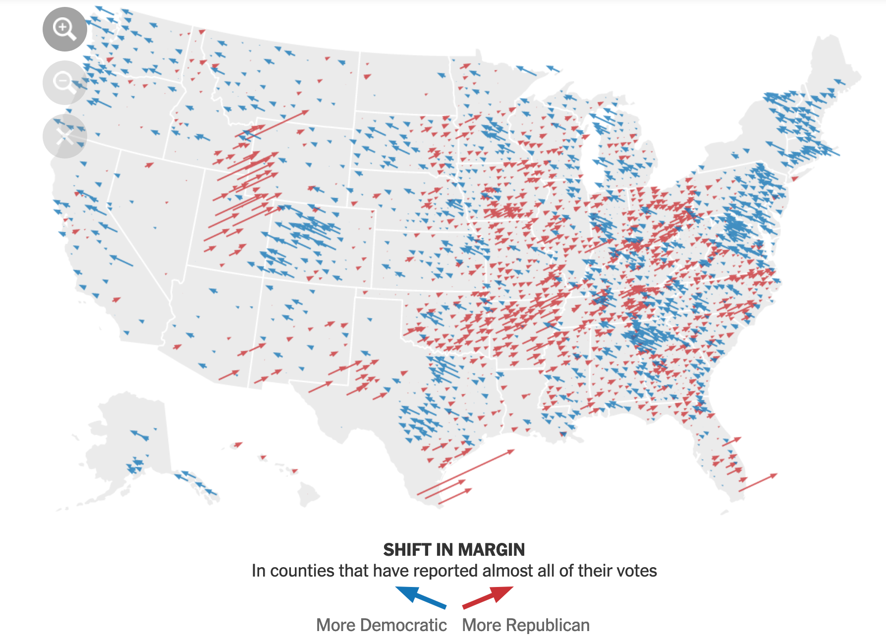

```{r setup, include=FALSE}
knitr::opts_chunk$set(echo = TRUE, 
                      warning = FALSE, 
                      message = FALSE)
```

The purpose of this post is to recreate the "Shift from 2016" arrow map that the New York Times used to show which counties became more Democratic or Republican-leaning from 2016 to 2020. This is a screenshot of the [NYTimes figure](https://www.nytimes.com/interactive/2020/11/03/us/elections/results-president.html?name=styln-transition&region=TOP_BANNER&block=storyline_menu_recirc&action=click&pgtype=LegacyCollection&impression_id=fe1cabd0-2862-11eb-a601-c3124439c207&variant=show):

```{r echo=FALSE}

```

I will use county-level Presidential election data from the [MIT Election Data + Science Lab](https://dataverse.harvard.edu/dataset.xhtml?persistentId=doi:10.7910/DVN/VOQCHQ) to recreate the chart. Since 2020 results are not final yet, I will focus on data from 2000-2016. I ran into multiple issues with the dataset, which I explain in the Code section below. The most signifcant issue was with the data from Alaska, which I excluded from the charts below because of problems with the data.

## Recreating the NYTimes Figure

My approach is to use `{ggplot2}` and `{sf}` to map the data and draw arrows at angles to display shifts in the Democratic margin.

```{r include=FALSE}
library(tidyverse)
library(lubridate)
library(janitor)
library(sf)
library(tigris)
library(tidycensus)
library(rmapshaper)
library(hrbrthemes)
library(scales)
library(NISTunits)
library(gganimate)

options(tigris_use_cache = TRUE,
        scipen = 999,
        digits = 4)

theme_set(theme_ipsum())

presidential_votes_shift <- read_csv("data/presidential_votes_shift.csv") %>% 
  mutate(shift_pct_scaled = rescale(shift_pct, to = c(0, 180)), #republican 0, democrat 180
         shift_votes_scaled = rescale(abs(shift_votes), to = c(10^4, 10^6)))

county_geo <- get_acs(variables = "B19013_001",
                                    geography = "county",
                                    geometry = TRUE,
                                    shift_geo = TRUE) %>% 
  select(NAME, GEOID) %>% 
  ms_simplify(keep_shapes = TRUE) %>% 
  mutate(center = map(geometry, st_centroid)) %>% 
  mutate(center_lon_x = map_dbl(center, 1),
         center_lat_y = map_dbl(center, 2)) 

state_geo <- get_acs(variables = "B19013_001",
                     geography = "state",
                     geometry = TRUE,
                     shift_geo = TRUE) %>% 
  ms_simplify() %>% 
  select(NAME, GEOID)

shift_map <- presidential_votes_shift %>% 
  left_join(county_geo, by = c("fips" = "GEOID")) %>% 
  select(-NAME) %>% 
  st_sf() %>% 
  rename(lng0 = center_lon_x,
         lat0 = center_lat_y) %>% 
  mutate(lng1 = lng0 + (shift_votes_scaled * cos(NISTdegTOradian(shift_pct_scaled))),
         lat1 = lat0 + (shift_votes_scaled * sin(NISTdegTOradian(shift_pct_scaled))))
```

This is the dataframe I use to make the final map. It contains the year, state, county, FIPS code, county and state geometries, and election results per county.

```{r}
glimpse(shift_map)
```

```{r fig.height=15, fig.width=15}
shift_map_filtered <- shift_map %>% 
  filter(state != "Alaska") %>%
  filter(year == 2016) %>% 
  mutate(shift_pct_binary = case_when(sign(shift_pct) == 1 ~ "Democratic",
                                      sign(shift_pct) == -1 ~ "Republican"),
         shift_pct_binary = as.factor(shift_pct_binary)) %>% 
  mutate(shift_votes_binned = abs(shift_votes) <= 3000)

ggplot() +
  geom_sf(data = filter(state_geo, !str_detect(NAME, "Alaska")),
          size = .2,
          fill = NA) +
  geom_point(data = filter(shift_map_filtered, abs(shift_votes) <= 1500),
             aes(x = lng0, y = lat0,
                 color = shift_pct_binary),
             size = .75,
             alpha = .3) +
  geom_segment(data = filter(shift_map_filtered, abs(shift_votes) > 1500),
               aes(x = lng0, xend = lng1,
                   y = lat0, yend = lat1,
                   color = shift_pct_binary,
                   size = shift_votes,
                   alpha = shift_votes_binned),
               linejoin = "mitre",
               arrow = arrow(length = unit(0.08, "inches"))) +
  scale_color_manual(values = c("#1375B7", "#C93135"), guide = guide_legend(title.position = "top")) +
  scale_size_continuous(range = c(.001, 2), guide = FALSE) +
  scale_alpha_manual(values = c(1, .3), guide = FALSE) +
  labs(color = "Shift in election margin") +
  facet_wrap(~year) +
  theme_void(base_size = 25) +
  theme(legend.direction = "horizontal",
        legend.position = "bottom")
```

The starting point of the line is the centroid of the county. The length and width of the lines are scaled to the shift in terms of number of votes. The NYTimes figure treats the shift as a binary variable when it rescales to degrees of the angle. In their graph, a Democratic shift is about 45 degrees (diagonal left) and a Republican shift is about 135 degrees (diagonal right). My figure maintains the continuous nature of the shift in %. I use the range 0-180 in degrees to indicate the shift. 0 degrees (all the way left) indicates a 100% shift towards Democrats, 90 degrees (pointing upwards) indicates no change, and 180 degrees (all the way to the right) indicates a 100% shift towards Republicans.

The end point of the line is calculated using the sine and cosine of the margin shift in % (re-scaled to be interpreted as degrees of an angle) multiplied by the margin shift in votes (re-scaled to be interpreted as meters), which is added to the origin point. 

I lower the opacity of the lines in counties where the vote totals did not shift much. I use points instead of lines for counties where there was a very small shift in votes. This prevents overplotting in geographically dense areas with small populations.

This animation shows the shift in Presidential election margin from 2004-2016.

```{r fig.height=15, fig.width=15}
political_winds_anim <- shift_map %>% 
  filter(state != "Alaska") %>% 
  mutate(id = str_c(state, county, fips)) %>% 
  mutate(year = as.integer(year)) %>% 
  mutate(shift_pct_binary = case_when(sign(shift_pct) == 1 ~ "Democratic",
                                      sign(shift_pct) == -1 ~ "Republican"),
         shift_pct_binary = as.factor(shift_pct_binary)) %>% 
  mutate(shift_votes_binned = abs(shift_votes) <= 3000) %>% 
  ggplot() +
  geom_sf(data = filter(state_geo, NAME != "Alaska"),
          size = .2,
          fill = NA) +
  geom_segment(aes(x = lng0, xend = lng1,
                   y = lat0, yend = lat1,
                   color = shift_pct_binary,
                   size = shift_votes,
                   alpha = shift_votes_binned,
                   group = id),
               linejoin = "mitre",
               arrow = arrow(length = unit(0.09, "inches"))) +
  scale_color_manual(values = c("#1375B7", "#C93135"), guide = guide_legend(title.position = "top")) +
  scale_size_continuous(range = c(.001, 1.3), guide = FALSE) +
  scale_alpha_manual(values = c(1, .3), guide = FALSE) +
  theme_void(base_size = 25) +
  theme(legend.direction = "horizontal",
        legend.position = "bottom") +
  transition_states(year) +
  labs(title = "Shift in Presidential election Democratic margin",
       subtitle = "Year: {closest_state}",
       color = "Shift in Democratic margin")

political_winds_anim
```

In the animation there is less overplotting, so I do not replace lines with dots for counties where there was a very small shift in votes.

## Code

### Ingest

```{r}
#election shift
#script to clean data

#data from https://electionlab.mit.edu/data

#fips info
#https://en.wikipedia.org/wiki/Federal_Information_Processing_Standard_state_code#FIPS_state_codes
#https://en.wikipedia.org/wiki/List_of_United_States_FIPS_codes_by_county
#changes https://www.census.gov/programs-surveys/geography/technical-documentation/county-changes.2010.html

#read in data
data <- read_csv("data/countypres_2000-2016.csv",
                 col_types = cols(
                   year = col_double(),
                   state = col_character(),
                   state_po = col_character(),
                   county = col_character(),
                   FIPS = col_character(),
                   office = col_character(),
                   candidate = col_character(),
                   party = col_character(),
                   candidatevotes = col_double(),
                   totalvotes = col_double(),
                   version = col_double()
                 )) %>% 
  clean_names()

glimpse(data)
```

### Clean

This code filters out state-wide vote tabulations and then filters only on the two-party Presidential vote.

```{r}
data <- data %>% 
  rename(fips_raw = fips) %>% 
  #filter out state-wide ballot collection
  filter(!(state == "Connecticut" & county == "Statewide writein")) %>% 
  filter(!(state == "Maine" & county == "Maine UOCAVA")) %>% 
  filter(!(state == "Rhode Island" & county == "Federal Precinct"))

#filter for only 2-party vote in presidential elections
data <- data %>% 
  filter(office == "President",
         party == "democrat" | party == "republican") %>% 
  arrange(state, county, fips_raw, year) %>% 
  replace_na(list(candidatevotes = 0))
```

Many of the FIPS codes from the source data dropped leading zeroes, which makes them unuseable for joining with Census data. This code adds the leading zeroes back.

```{r}
#clean fips data
states_with_bad_fips <- str_to_title(c("ALABAMA", "ALASKA", "ARIZONA", 
                                      "ARKANSAS", "CALIFORNIA",
                                      "COLORADO", "CONNECTICUT"))
data %>% 
  filter(state %in% states_with_bad_fips) %>% 
  mutate(fips = paste0("0", fips_raw)) %>% 
  distinct(fips_raw, fips)

data <- data %>% 
  #add "0" to front of states where leading "0" was dropped
  mutate(fips = case_when(state %in% states_with_bad_fips ~ paste0("0", fips_raw),
                          !(state %in% states_with_bad_fips) ~ fips_raw))
```

I had to make a variety of decisions about how to clean up the data with regards to county geometries. The MIT data does not reflect cases where counties changed names or FIPS codes, or where counties merged. This code manually makes the changes necessary to join the data with Census geometry data. Note that I do not attempt to fix the data for Alaska, which was extremely different than the Census data. I was not confident that I could make accurate adjustments in this case, so I excluded Alaska entirely. These changes are not optimal, but I think it is close enough.

```{r}
#decisions to make with wonky geometry
#merge records for Shannnon and Oglala Lakota counties in SD
#merge Kansas City Missouri and Jackson County Missouri
#merge Bedford (city) fips 51515 with Bedford county 51019

data <- data %>% 
  #update Oglala Lakota SD fips
  #changed in 2015 https://www.census.gov/programs-surveys/geography/technical-documentation/county-changes.2010.html
  mutate(fips = case_when(state == "South Dakota" & county == "Oglala Lakota" ~ "46102",
                          TRUE ~ fips)) %>% 
  #merge Kansas City Missouri with Jackson County Missouri
  mutate(county = case_when(state == "Missouri" & county == "Kansas City" ~ "Jackson",
                            TRUE ~ county),
         fips = case_when(state == "Missouri" & county == "Jackson" ~ "29095",
                          TRUE ~ fips)) %>% 
  #merge Bedford (city) fips 51515 with Bedford county 51019
  mutate(fips = case_when(state == "Virginia" & county == "Bedford" & fips == "51515" ~ "51019",
                          TRUE ~ fips))
```

This compares the counties in the MIT data vs. what is in the Census API. Besides Alaska, this shows that my manual changes accounted for the issues I identified.

```{r}
counties <- get_acs(variables = "B19013_001",
                      geography = "county",
                      geometry = FALSE) %>% 
  #mutate(census_geo_year = 2010) %>% 
  select(NAME, GEOID)
```

```{r}
#alaska falls out: this is expected
#Broomfield County CO falls out for year 2000: was part of Boulder County in 2000
#Oglala Lakota County SD falls out for year 2000: was Shannon County in 2000
#
data %>% 
  select(year, state, county, fips) %>% 
  filter(state != "Alaksa") %>% 
  anti_join(counties, by = c("fips" = "GEOID")) %>% 
  count(state)
```

The process of merging some counties meant that I had to summarize the election results to the level of my new "adjusted" counties. This code performs that process.

```{r}
#some counties have 4 records because of merging process
data %>%
  select(state, county, fips, year) %>% 
  add_count(state, county, fips, year) %>% 
  distinct(n)
```

```{r}
#summarize candidatevotes to account for merged counties
data %>% 
  select(state, county, fips, year, office, party, candidate, candidatevotes) %>% 
  group_by(state, county, fips, year, office, party, candidate) %>% 
  summarize(candidatevotes_sum = sum(candidatevotes)) %>% 
  ungroup() %>% 
  add_count(state, county, fips, year) %>% 
  #confirm that each county only has 2 records
  distinct(n)
```

```{r}
data <- data %>% 
  select(state, county, fips, year, office, party, candidate, candidatevotes) %>% 
  group_by(state, county, fips, year, office, party, candidate) %>% 
  summarize(candidatevotes_sum = sum(candidatevotes)) %>% 
  ungroup()
```

### Munge

This part performs the more straightfoward tasks of calculating a candidate's % of the vote and the election-to-election shift in %.

```{r}
presidential_votes <- data %>% 
  group_by(year, state, county, fips) %>% 
  mutate(pct_vote = candidatevotes_sum / sum(candidatevotes_sum)) %>% 
  ungroup() %>% 
  select(year, state, county, fips, party, candidatevotes_sum, pct_vote)
```

```{r}
presidential_votes_shift <- presidential_votes %>% 
  pivot_wider(names_from = party, values_from = c(candidatevotes_sum, pct_vote)) %>%
  mutate(dem_margin_pct = pct_vote_democrat - pct_vote_republican,
         dem_margin_votes = candidatevotes_sum_democrat - candidatevotes_sum_republican) %>% 
  arrange(state, county, fips, year) %>% 
  group_by(state, county, fips) %>% 
  mutate(shift_pct = dem_margin_pct - lag(dem_margin_pct),
         shift_votes = dem_margin_votes - lag(dem_margin_votes)) %>% 
  filter(row_number() > 1) %>% 
  ungroup()
```

Finally, this creates new variables that rescale the shift in % and votes to degrees and meters, respectively. I also create variations of `shift_pct` and `shift_votes` to use in the graph.

```{r}
presidential_votes_shift <- presidential_votes_shift %>% 
  mutate(shift_pct_scaled = rescale(shift_pct, to = c(0, 180)), #republican 0, democrat 180
         shift_votes_scaled = rescale(abs(shift_votes), to = c(10^4, 10^6))) %>% 
  mutate(shift_pct_binary = case_when(sign(shift_pct) == 1 ~ "Democratic",
                                      sign(shift_pct) == -1 ~ "Republican"),
         shift_pct_binary = as.factor(shift_pct_binary)) %>% 
  mutate(shift_votes_binned = abs(shift_votes) <= 3000)
```

```{r}
#create shift map object
shift_map <- presidential_votes_shift %>% 
  left_join(county_geo, by = c("fips" = "GEOID")) %>% 
  st_sf() %>% 
  rename(lng0 = center_lon_x,
         lat0 = center_lat_y) %>% 
  mutate(lng1 = lng0 + (shift_votes_scaled * cos(NISTdegTOradian(shift_pct_scaled))),
         lat1 = lat0 + (shift_votes_scaled * sin(NISTdegTOradian(shift_pct_scaled))))
```

```{r eval = FALSE}
shift_map_filtered <- shift_map %>% 
  filter(state != "Alaska") %>%
  filter(year == 2016) %>% 
  mutate(shift_pct_binary = case_when(sign(shift_pct) == 1 ~ "Democratic",
                                      sign(shift_pct) == -1 ~ "Republican"),
         shift_pct_binary = as.factor(shift_pct_binary))

ggplot() +
  geom_sf(data = filter(state_geo, !str_detect(NAME, "Alaska")),
          size = .2,
          fill = NA) +
  geom_point(data = filter(shift_map_filtered, abs(shift_votes) <= 1500),
             aes(x = lng0, y = lat0,
                 color = shift_pct_binary),
             size = .75,
             alpha = .3) +
  geom_segment(data = filter(shift_map_filtered, abs(shift_votes) > 1500),
               aes(x = lng0, xend = lng1,
                   y = lat0, yend = lat1,
                   color = shift_pct_binary,
                   size = shift_votes,
                   alpha = shift_votes_binned),
               linejoin = "mitre",
               arrow = arrow(length = unit(0.08, "inches"))) +
  scale_color_manual(values = c("#1375B7", "#C93135"), guide = guide_legend(title.position = "top")) +
  scale_size_continuous(range = c(.001, 2), guide = FALSE) +
  scale_alpha_manual(values = c(1, .3), guide = FALSE) +
  labs(color = "Shift in election margin") +
  facet_wrap(~year) +
  theme_void(base_size = 25) +
  theme(legend.direction = "horizontal",
        legend.position = "bottom")
```

```{r eval = FALSE}
political_winds_anim <- shift_map %>% 
  filter(state != "Alaska") %>% 
  mutate(id = str_c(state, county, fips)) %>% 
  mutate(year = as.integer(year)) %>% 
  mutate(shift_votes_binned = abs(shift_votes) <= 3000) %>% 
  ggplot() +
  geom_sf(data = filter(state_geo, NAME != "Alaska"),
          size = .2,
          fill = NA) +
  geom_segment(aes(x = lng0, xend = lng1,
                   y = lat0, yend = lat1,
                   color = shift_pct_binary,
                   size = shift_votes,
                   alpha = shift_votes_binned,
                   group = id),
               linejoin = "mitre",
               arrow = arrow(length = unit(0.09, "inches"))) +
  scale_color_manual(values = c("#1375B7", "#C93135"), guide = guide_legend(title.position = "top")) +
  scale_size_continuous(range = c(.001, 1.3), guide = FALSE) +
  scale_alpha_manual(values = c(1, .3), guide = FALSE) +
  theme_void(base_size = 25) +
  theme(legend.direction = "horizontal",
        legend.position = "bottom") +
  transition_states(year) +
  labs(title = "Shift in Presidential election Democratic margin",
       subtitle = "Year: {closest_state}",
       color = "Shift in Democratic margin")

political_winds_anim
```
