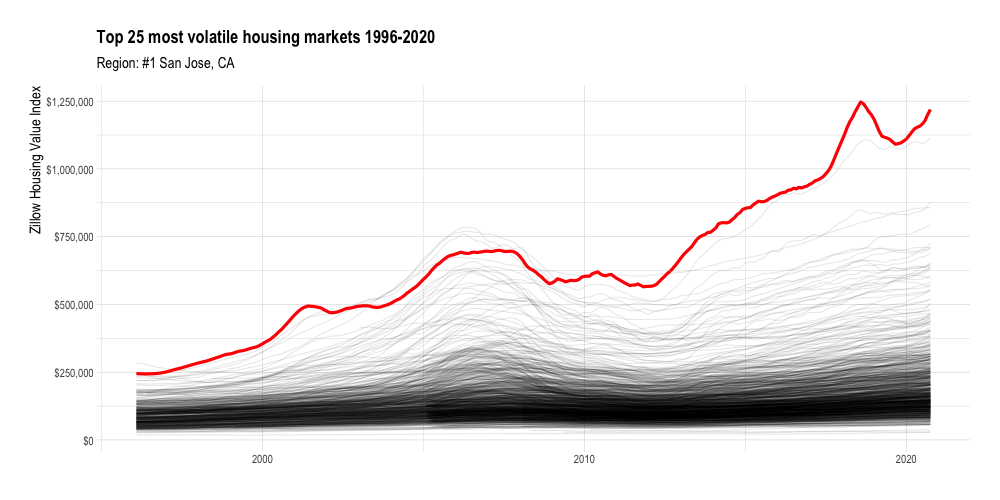

```{r setup, include = FALSE}
knitr::opts_chunk$set(echo = TRUE, 
                      warning = FALSE, 
                      message = FALSE)
```

Zillow publishes a variety of cool data that I haven't explored much yet. The first dataset that caught my eye was the Zillow Home Value Index (ZHVI). Zillow describes it as the "smoothed, seasonally adjusted measure of the typical home value and market changes across a given region and housing type". In this post I will make a quick `gganimate` plot of the ZHVI of various metro areas in the U.S.

```{r}
library(tidyverse)
library(lubridate)
library(janitor)
library(hrbrthemes)
library(gganimate)

options(scipen = 999, digits = 4)

theme_set(theme_ipsum())
```

The first thing I noticed about the data is that it is *aggressively* wide. There is a column for each year-month in the dataset. 302 columns is a lot to work with.

```{r}
#download housing data from https://www.zillow.com/research/data/
zillow_house_value <- list.files("data", full.names = TRUE) %>% 
  set_names() %>% 
  map_dfr(read_csv)

dim(zillow_house_value)
```

To make the data more tidy, I use a regex to identify the columns that have a date in the name and pivot those longer. Now each row represents the ZHVI for a given metro area on a given year-month.
```{r}
zillow_house_value <- zillow_house_value %>% 
  pivot_longer(cols = matches("\\d{4}-\\d{2}-\\d{2}"),
               names_to = "date", values_to = "zhvi") %>% 
  clean_names() %>% 
  mutate(date = ymd(date),
         region_name = str_squish(region_name))

glimpse(zillow_house_value)
```

Once the data is tidy, it is easy to plot with `ggplot2`. In this graph, each line represents one metro area.
```{r}
zillow_house_value %>% 
  ggplot(aes(date, zhvi, group = region_name)) +
  geom_line(alpha = .1, size = .5)
```

What struck me is that while most metro areas in the dataset start with ZHVI < $300,000, many increase to 3x that, with many wild swings along the way due to housing bubbles, economic crashes, and housing scarcity. I will rank the metro areas by volatility (standard deviation of ZHVI) and use `ggplot2` and `gganimate` to highlight the most volatile metro areas.
```{r}
#find most volatile regions
df_top_regions <- zillow_house_value %>% 
  group_by(region_name) %>% 
  summarize(sd = sd(zhvi)) %>% 
  ungroup() %>% 
  arrange(desc(sd)) %>% 
  slice(1:25) %>% 
  mutate(region_name_rank = str_c("#", row_number(), " ", region_name, sep = ""))
  
region_name_highlight_fct <- df_top_regions %>% 
  pull(region_name)

region_name_rank_fct <- df_top_regions %>% 
  pull(region_name_rank)
```

```{r eval = FALSE}
#create highlight df
df_highlights <- zillow_house_value %>% 
  inner_join(df_top_regions) %>% 
  mutate(region_name_highlight = region_name,
         region_name_highlight = factor(region_name_highlight, levels = region_name_highlight_fct),
         region_name_rank = factor(region_name_rank, levels = region_name_rank_fct))

housing_animation <- zillow_house_value %>% 
  ggplot() +
  geom_line(aes(date, zhvi, group = region_name), alpha = .1, size = .5) +
  geom_line(data = df_highlights,
            aes(date, zhvi),
            color = "red", size = 1.5) +
  scale_y_continuous(labels = scales::dollar_format()) +
  transition_manual(region_name_rank) +
  labs(title = "Top 25 most volatile housing markets 1996-2020",
       subtitle = "Region: {current_frame}",
       x = NULL,
       y = "Zillow Housing Value Index") +
  theme(plot.subtitle = element_text(size = 15),
        axis.title.y = element_text(size = 15))

anim_save("output/housing_animation.gif", animation = housing_animation,
          duration = 40, fps = 20, width = 1000, height = 500)
```

